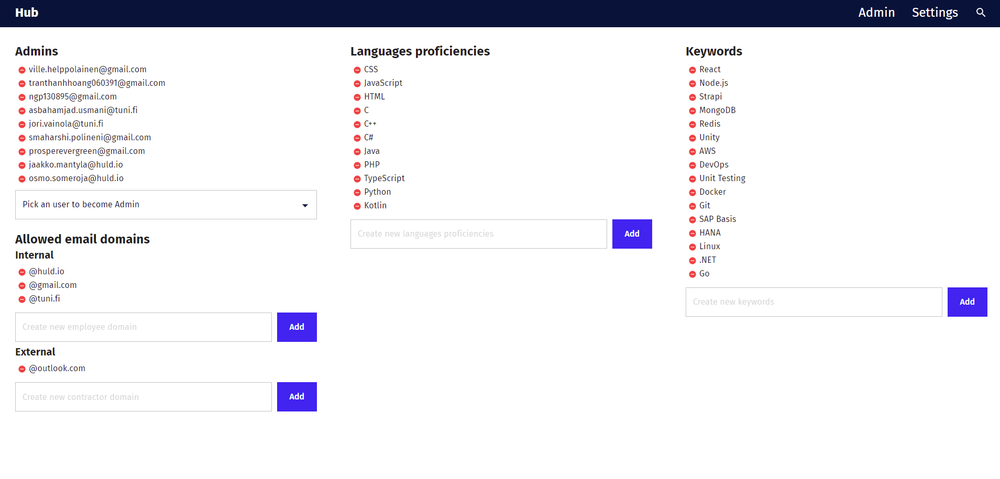

# Huld hub

## Table of contents
- [Introduction](#Introduction)
- [Authors](#Authors)
- [Usage](#Usage)
- [Dev work flow](#DevWorkFlow)
- [Used technologies](#UsedTechnologies)
- [User guide](#UserGuide)


## Introduction <a name=Introduction></a>

This is an application for keeping track of employees skills, work history, education, and other notable points of interest. The primary purpose of the application is to search users based on their skills and talents they have listed and find coworkers that possess skills that are required. Search return a listing of users, that may be viewed in more detail.


Application requires a login before any information can be accessed and registration is allowed only allowed if users email has the correct domain. Admin can configure what email domains are valid. Upon registering successfully, confirmation email containing a confirmation link will be sent to the given email address. Another email can be sent if necessary.


All users have profile that others can view. These profiles contain peoples name, title, image, contact information, bio, skills, languages, keywords, work history, and education. User can modify their own profile and admins can edit everyones profiles. Admin can also delete other users.


Application has several configurations. Only selected email domains can be registered, and only selected languages and keywords may be used in the user profiles. Users can also be promoted into admins and demoted from the settings page.




## Authors <a name=Authors></a>

- Prosper Evergreen, prosper.evergreen@tuni.fi
- Ville Helppolainen, ville.helppolainen@tuni.fi
- Phu Nguyen, phu.g.nguyen@tuni.fi
- Sai Polineni, sai.polineni@tuni.fi
- Hoang Tran, hoang.tran@tuni.fi
- Asbah Usmani, asbahamjad.usmani@tuni.fi
- Jori Väinölä, jori.vainola@tuni.fi

## Usage <a name=Usage></a>

To start this application you must run both backend and web applications. Instruction on how to do this can be found in files [backend/README](./backend/README.md) and [web/README](./web/README.md). These files also contain other information like available commands and troubleshooting intructions.

## Dev work flow <a name=DevWorkFlow></a>
You can follow the [convetional commits](https://www.conventionalcommits.org/en/v1.0.0/) for naming branches and commit messages.

1. When you start working on a feature, create a new branch from the `main` branch. For example the branch will be `feat/login`
```bash
git checkout -b feat/login
```
2. Add your changes to the branch:
```bash
git add ./components/login/index.jsx
git add ./components/login/login.test.js
git commit -m 'feat: added login components'
```
3. When you are done with your changes and ready to submit a Pull Request, push the changes to remote:
```bash
git push origin feat/login
```
4. Go to the repo, it should show that you have a new branch that has just been pushed to. You can create a PR from that or create one manually. Fill in the PR descriptions, add some reviewers, labels, assign yourself to the PR and create the PR.
5. Once the PR is approved, we can merge the PR to the `main` branch. Don't forget to write a descriptive merge message.

## Used technologies <a name=UsedTechnologies></a>

This entire project utilizes Docker to run the application is same environment for all developers.

Backend uses Strapi, which is a node js based content management system. 

Web application is React based and styled with CSS.

## User Guide <a name=UserGuide></a>

User guide can be found in a seperate file by name 'User guide' in the folder documentation